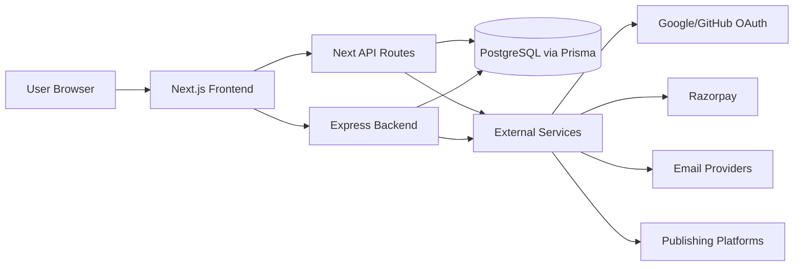
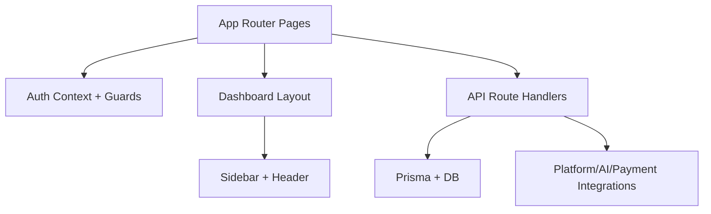
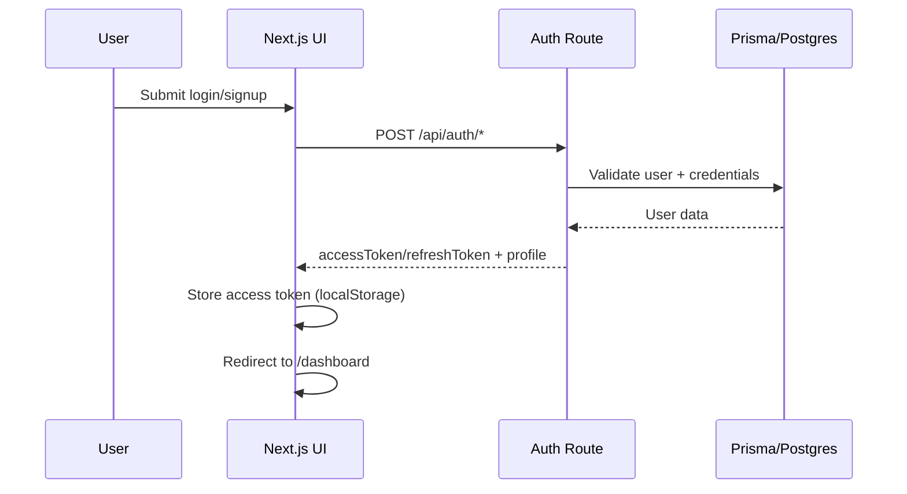
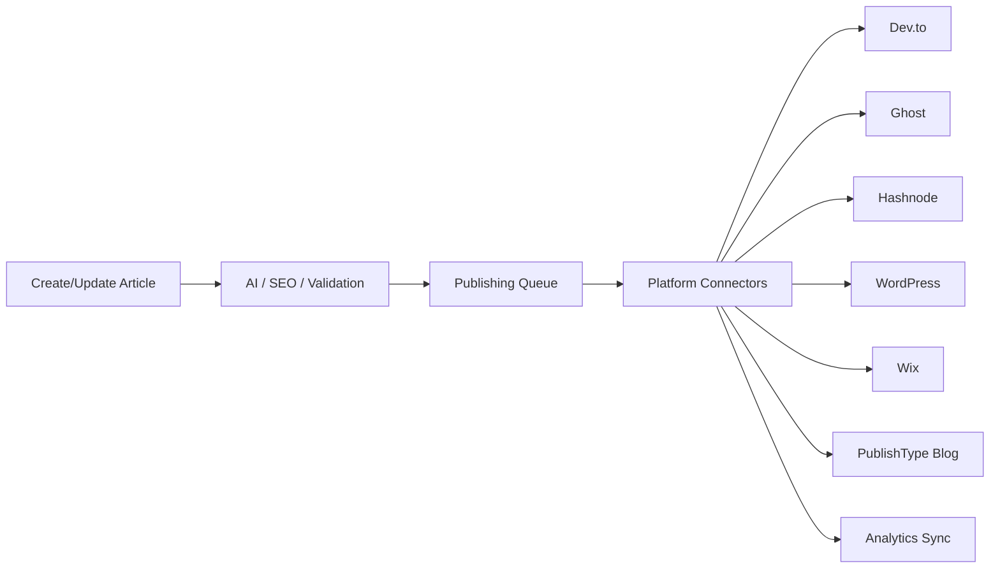

# PublishType (Blogweb) Monorepo

AI-assisted blogging and multi-platform publishing SaaS with:
- `frontend/`: Next.js 16 app (UI + App Router APIs + Prisma integration)
- `backend/`: Express service (dedicated REST APIs)

This README is the single source of truth for setup, architecture, workflow, and system design.

## Stack

### Frontend
- Next.js 16, React 19, TypeScript
- Tailwind CSS, Lucide icons
- Prisma + PostgreSQL
- NextAuth (beta), JWT, Zod
- TipTap editor, Recharts, Socket.io client, Sonner

### Backend
- Express 4, Node.js
- Prisma + PostgreSQL
- JWT, bcrypt, Zod
- Razorpay support

## Monorepo Structure

```text
Blogweb/
├─ frontend/
│  ├─ app/                    # Next App Router pages + route handlers
│  │  ├─ dashboard/           # User dashboard + embedded admin views
│  │  ├─ admin/               # Full admin module pages
│  │  └─ api/                 # Next route handlers (auth, admin, analytics, etc.)
│  ├─ components/             # UI, layout, editor, modals
│  ├─ lib/                    # services, context, hooks, middleware helpers
│  ├─ prisma/                 # Prisma schema and migrations
│  └─ package.json
├─ backend/
│  ├─ src/
│  │  ├─ controllers/
│  │  ├─ routes/
│  │  ├─ services/
│  │  ├─ middleware/
│  │  ├─ db/
│  │  └─ utils/
│  └─ package.json
├─ package.json               # root scripts to orchestrate apps
└─ README.md
```

## High-Level Architecture



## Runtime Design (Frontend)



## Authentication Flow



## Content & Publishing Workflow



## Admin vs User Experience

- **User** lands on `/dashboard`
- **Admin** also lands on `/dashboard` (can act as regular user)
- Admin section is available in dashboard sidebar:
  - `User Management`
  - `All Articles`
  - `Moderation`
  - `Profile Settings`
- Admin pages render in embedded mode inside dashboard where required.

## Routes (Important)

### Public
- `/`
- `/login`, `/signup`
- `/forgot-password`, `/reset-password`, `/verify-email`
- `/pricing`, `/features`, `/blog`, `/about`, `/contact`, `/help`, etc.

### Dashboard
- `/dashboard`
- `/dashboard/articles`, `/dashboard/blogs`, `/dashboard/analytics`
- `/dashboard/integrations`, `/dashboard/team`, `/dashboard/settings`
- `/dashboard/admin/*` (embedded admin views)

### Admin Module
- `/admin/users`
- `/admin/articles`
- `/admin/moderation`
- `/admin/settings`

## API Surface (Backend Express)

Key route groups in `backend/src/routes/`:
- `auth.routes.js`
- `user.routes.js` / `users.routes.js`
- `articles.routes.js`
- `blogs.routes.js`
- `analytics.routes.js`
- `platforms.routes.js`
- `publishing.routes.js`
- `payments.routes.js`

## Local Development

### Prerequisites
- Node.js 20+
- npm 10+
- PostgreSQL (or managed DB with valid Prisma connection string)

### Install

```bash
npm install
npm install --prefix frontend
npm install --prefix backend
```

### Environment

Create and populate:
- `frontend/.env`
- `backend/.env`

At minimum, configure:
- DB connection (`DATABASE_URL`)
- Auth secrets/JWT
- OAuth credentials (Google/GitHub) if using social login
- Payment and email provider keys if enabled

### Run

### Terminal 1 (Frontend)
```bash
npm run dev:frontend
```

### Terminal 2 (Backend)
```bash
npm run dev:backend
```

Frontend default: `http://localhost:3000`

### Database

Frontend Prisma scripts:
```bash
npm run postinstall --prefix frontend   # prisma generate
npm run build --prefix frontend         # prisma generate + next build
```

Backend Prisma scripts:
```bash
npm run prisma:generate --prefix backend
npm run prisma:migrate --prefix backend
npm run prisma:push --prefix backend
```

## Available Scripts

### Root
```bash
npm run dev
npm run dev:frontend
npm run dev:backend
npm run build
npm run start
```

### Frontend
```bash
npm run dev --prefix frontend
npm run build --prefix frontend
npm run start --prefix frontend
npm run lint --prefix frontend
npm run seed:admin --prefix frontend
```

### Backend
```bash
npm run dev --prefix backend
npm run start --prefix backend
npm run prisma:generate --prefix backend
npm run prisma:migrate --prefix backend
npm run prisma:push --prefix backend
```

## Product Workflow (Recommended)

1. User/Admin signs in on web app.
2. Create and edit content in dashboard.
3. Run AI/SEO checks (where enabled).
4. Publish to internal blog and/or external platforms.
5. Track engagement in analytics pages.
6. Admin moderates content and users.

## Notes for Contributors

- Keep auth and routing behavior consistent across dashboard/admin.
- Prefer reusable components in `frontend/components`.
- Keep DB schema changes coordinated with Prisma migration flow.
- If adding routes, update this README section for key paths.

## License

Proprietary. All rights reserved.
